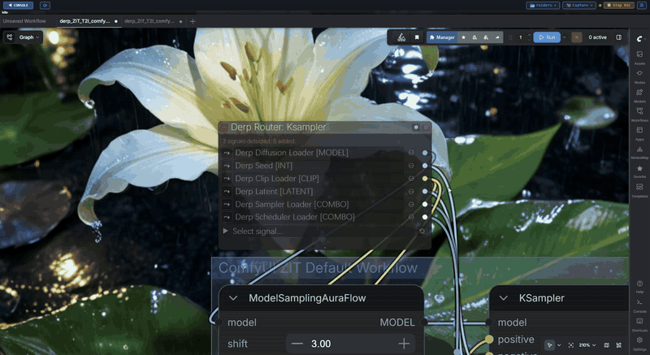

A custom node pack for derp-themed utilities that looks at standard UI frameworks and says "nah, we're good." By completely bypassing Comfy's default UI, these nodes are blissfully immune to breaking frontend updates (so far...). It's built for speed, maintaining 60fps as long as you keep those default nodes out of the viewport. Toss out the spaghetti monster with wireless inputs/outputs, swap custom themes in real-time when the mood strikes, and grab full control of your canvas with node docking and sticky dragging that'll make you wonder why you ever suffered through default group methods. Highly unbothered, highly optimized, and just a little bit... weird.

---

## Node Index

### Management Nodes

- [Derp Router](derp_docs/Management%20Nodes/Derp%20Router.md) · [老登路由器](derp_docs/Management%20Nodes/Derp%20Router_ZH.md)

### ControlDeck Nodes

- [Derp Latent](derp_docs/ControlDeck%20Nodes/Derp%20Latent.md) · [老登潜空间](derp_docs/ControlDeck%20Nodes/Derp%20Latent_ZH.md)
- [Derp Model Loader](derp_docs/ControlDeck%20Nodes/Derp%20Model%20Loader.md) · [老登模型加载器](derp_docs/ControlDeck%20Nodes/Derp%20Model%20Loader_ZH.md)
- [Derp VAE Loader](derp_docs/ControlDeck%20Nodes/Derp%20Vae%20Loader.md) · [老登 VAE 加载器](derp_docs/ControlDeck%20Nodes/Derp%20Vae%20Loader_ZH.md)
- [Derp Sampler Loader](derp_docs/ControlDeck%20Nodes/Derp%20Sampler%20Loader.md) · [老登采样器加载器](derp_docs/ControlDeck%20Nodes/Derp%20Sampler%20Loader_ZH.md)
- [Derp Scheduler Loader](derp_docs/ControlDeck%20Nodes/Derp%20Scheduler%20Loader.md) · [老登调度器加载器](derp_docs/ControlDeck%20Nodes/Derp%20Scheduler%20Loader_ZH.md)
- [Derp Seed V2](derp_docs/ControlDeck%20Nodes/Derp%20SeedV2.md) · [老登种子 V2](derp_docs/ControlDeck%20Nodes/Derp%20SeedV2_ZH.md)
- [Derp Diffusion Loader](derp_docs/ControlDeck%20Nodes/Derp%20Diffusion%20Loader.md) · [老登扩散模型加载器](derp_docs/ControlDeck%20Nodes/Derp%20Diffusion%20Loader_ZH.md)
- [Derp CLIP Loader](derp_docs/ControlDeck%20Nodes/Derp%20Clip%20Loader.md) · [老登 CLIP 加载器](derp_docs/ControlDeck%20Nodes/Derp%20Clip%20Loader_ZH.md)