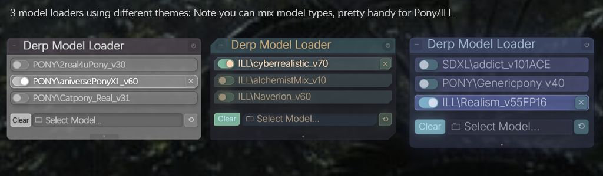

# 老登 模型加载器

把普通SD模型（.safetensors / .pt）加载到面板上，点击直接切换下次执行使用的模型，不再需要翻下拉菜单找文件。使用大容量模型或现存不够时，切换模型时会自动清理现存（默认设置），避免ComfyUI进入“半死机”状态。

<strong>重要：</strong> 需要 [derpRouter](../Management%20Nodes/Derp%20Router.md) 才能工作。

### 能干什么

<strong>刷新</strong>：下载了新模型后点一下，不用重启 ComfyUI。

<strong>移除</strong>：从面板上删掉一个模型。

<strong>拖拽排序</strong>：拖动模型条目来调整顺序，只影响显示，不影响输出。

#### 系统面板选项

<strong>显示文件夹名</strong>：开关模型条目中文件夹路径的显示。

<strong>切换模型时清显存</strong>：选择新模型时自动释放 VRAM。默认开启。

<strong>加载配置</strong>：保存、读取、改名、复制面板排列。可以为不同用途保存不同的模型组合。默认配置为空，因为每个人的模型路径和命名都不一样。